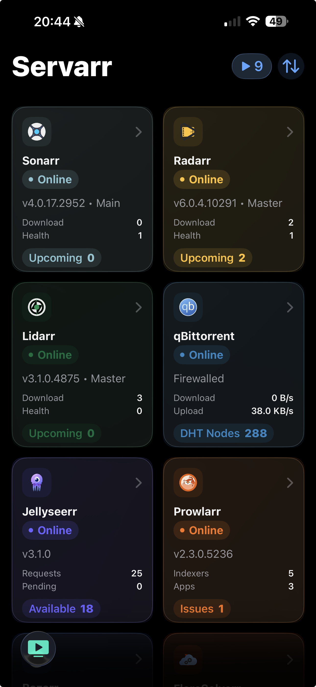
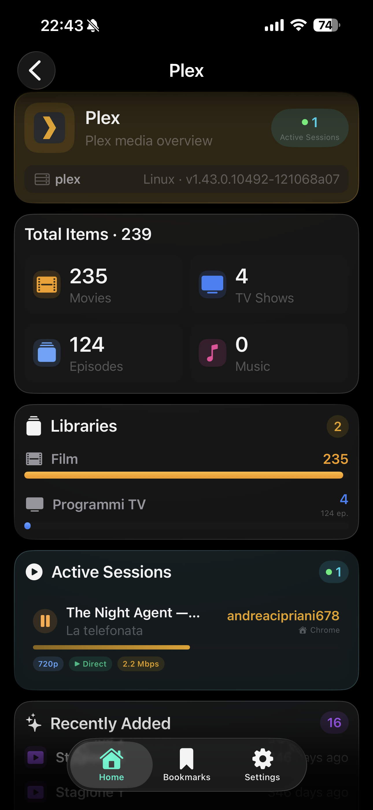
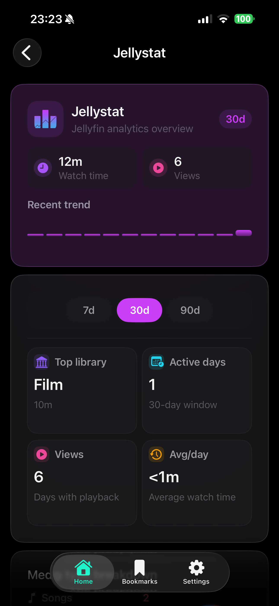
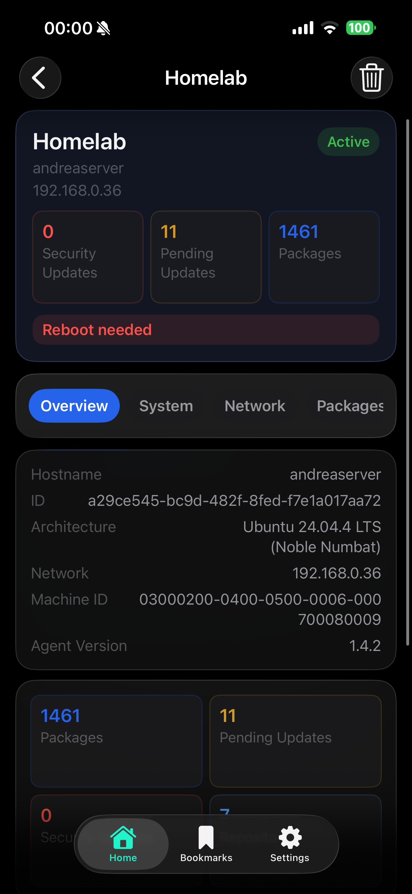
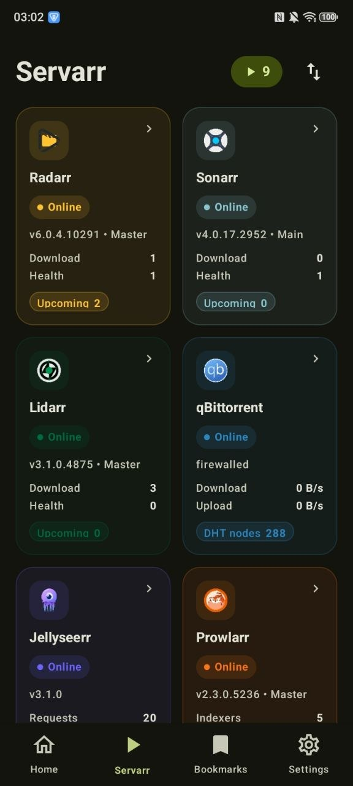
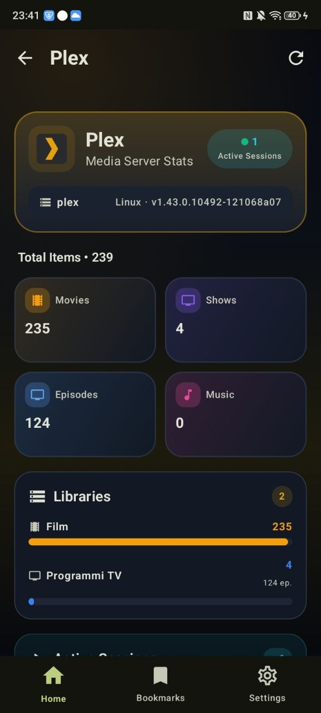
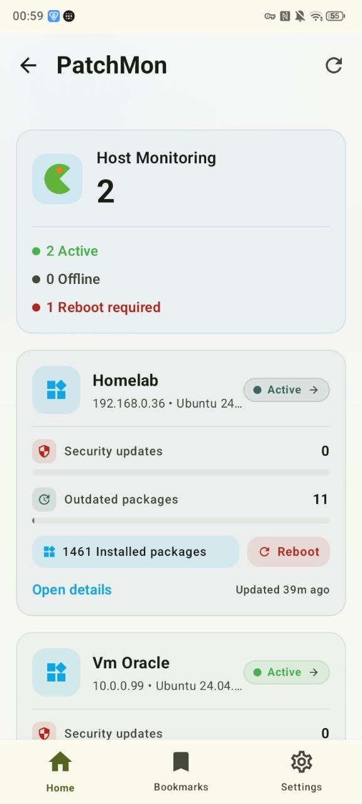
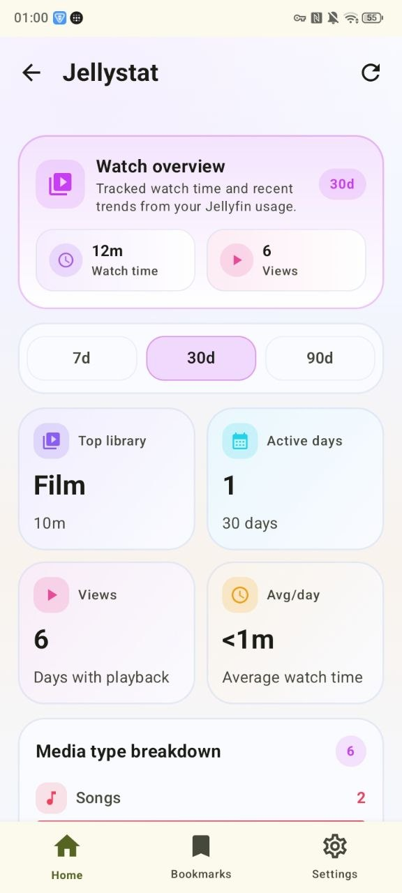

# 🏠 Homelab Dashboard

[](https://swift.org)
[](https://kotlinlang.org)
[](https://developer.apple.com/ios/)
[](https://developer.android.com)
[](https://developer.apple.com/xcode/swiftui/)
[](https://developer.android.com/jetpack/compose)

A premium, fully native dual-platform solution for monitoring and managing your personal Homelab ecosystem. This project features two distinct, purpose-built native applications sharing the same design soul but optimized for their respective platforms.

> **Disclaimer:** This is a **vibe-coding** project built for fun and personal use. It is provided as-is with no guarantees. The author assumes no responsibility for any issues, data loss, or damages resulting from the use of this software.

[](https://star-history.com/#JohnnWi/homelab-project&Date)

---

## Highlights

- **23 integrated services** —  Portainer,  Pi-hole,  Beszel,  Gitea,  Nginx Proxy Manager (+ NPMplus),  AdGuard DNS,  Healthcheck,  Patchmon,  Jellystat,  Plex,  Tailscale,  Bookmarks,  Sonarr,  Radarr,  Lidarr,  Prowlarr,  qBittorrent,  Bazarr,  FlareSolverr,  Technitium DNS,  Pangolin,  Dockhand, Linux Update.
- **Servarr stack** — Complete media automation dashboard: Sonarr + Radarr + Lidarr + Prowlarr + Bazarr + FlareSolverr + qBittorrent + Gluetun, unified in a single view.
- **Multi-instance support** — Add multiple instances of the same service and switch between them seamlessly.
- **Alternate app icons** — 6 variants to choose from: Default, Dark, Clear Light, Clear Dark, Tinted Light, Tinted Dark.
- **Cyberpunk mode** — Toggle a unique cyberpunk visual theme for your service cards.
- **Multilingual** — English, Italian, French, Spanish, German — auto-detected from your system language.
- **2 native apps** — Swift 6 + SwiftUI (iOS) and Kotlin + Jetpack Compose (Android).

---

## 📱 iOS Version (Swift Native + Liquid Glass)
Developed with **Swift 6** and **SwiftUI**, utilizing the latest native iOS 26 technologies. The UI is built around the **Liquid Glass** design system, leveraging frosted glass effects and fluid animations for a high-end feel.

<table align="center">
  <tr>
    <th>Dashboard</th>
    <th>Servarr</th>
    <th>Bookmarks</th>
  </tr>
  <tr>
    <td align="center"></td>
    <td align="center"></td>
    <td align="center"></td>
  </tr>
</table>

<table align="center">
  <tr>
    <td align="center"></td>
    <td align="center"></td>
    <td align="center"></td>
    <td align="center"></td>
    <td align="center"></td>
  </tr>
  <tr>
    <td align="center"><sub>Portainer</sub></td>
    <td align="center"><sub>Beszel</sub></td>
    <td align="center"><sub>Nginx Proxy</sub></td>
    <td align="center"><sub>Pi-hole</sub></td>
    <td align="center"><sub>Plex</sub></td>
  </tr>
</table>

<details>
<summary><b>📸 View all iOS screenshots</b></summary>
<br>

**Portainer**
<table>
  <tr>
    <td align="center"></td>
    <td align="center"></td>
    <td align="center"></td>
  </tr>
</table>

**Nginx Proxy Manager / NPMplus**
<table>
  <tr>
    <td align="center"></td>
    <td align="center"></td>
    <td align="center"></td>
  </tr>
</table>

**Beszel**
<table>
  <tr>
    <td align="center"></td>
    <td align="center"></td>
    <td align="center"></td>
    <td align="center"></td>
    <td align="center"></td>
    <td align="center"></td>
  </tr>
</table>

**Pi-hole** · **AdGuard DNS** · **Healthcheck**
<table>
  <tr>
    <td align="center"></td>
    <td align="center"></td>
    <td align="center"></td>
    <td align="center"></td>
    <td align="center"></td>
  </tr>
</table>

**Gitea / Forgejo** · **Patchmon** · **Jellystat** · **Plex**
<table>
  <tr>
    <td align="center"></td>
    <td align="center"></td>
    <td align="center"></td>
    <td align="center"></td>
  </tr>
</table>

</details>

---

## 🤖 Android Version (Kotlin Native + Material Expressive 3)
Built with **Kotlin** and **Jetpack Compose**, following the **Material Expressive 3** design language. It focuses on dynamic color integration, haptic-rich interactions, and modern Android architecture.

<table align="center">
  <tr>
    <th>Dashboard</th>
    <th>Servarr</th>
    <th>Bookmarks</th>
  </tr>
  <tr>
    <td align="center"></td>
    <td align="center"></td>
    <td align="center"></td>
  </tr>
</table>

<table align="center">
  <tr>
    <td align="center"></td>
    <td align="center"></td>
    <td align="center"></td>
    <td align="center"></td>
    <td align="center"></td>
  </tr>
  <tr>
    <td align="center"><sub>Portainer</sub></td>
    <td align="center"><sub>Beszel</sub></td>
    <td align="center"><sub>Nginx Proxy</sub></td>
    <td align="center"><sub>Pi-hole</sub></td>
    <td align="center"><sub>Plex</sub></td>
  </tr>
</table>

<details>
<summary><b>📸 View all Android screenshots</b></summary>
<br>

**Portainer**
<table>
  <tr>
    <td align="center"></td>
    <td align="center"></td>
    <td align="center"></td>
  </tr>
</table>

**Beszel**
<table>
  <tr>
    <td align="center"></td>
    <td align="center"></td>
    <td align="center"></td>
    <td align="center"></td>
    <td align="center"></td>
    <td align="center"></td>
    <td align="center"></td>
    <td align="center"></td>
  </tr>
</table>

**Nginx Proxy Manager / NPMplus** · **Pi-hole**
<table>
  <tr>
    <td align="center"></td>
    <td align="center"></td>
    <td align="center"></td>
    <td align="center"></td>
  </tr>
</table>

**AdGuard DNS** · **Healthcheck** · **Patchmon** · **Jellystat** · **Plex**
<table>
  <tr>
    <td align="center"></td>
    <td align="center"></td>
    <td align="center"></td>
    <td align="center"></td>
    <td align="center"></td>
    <td align="center"></td>
    <td align="center"></td>
  </tr>
</table>

**Bookmarks**
<table>
  <tr>
    <td align="center"></td>
    <td align="center"></td>
  </tr>
</table>

</details>

---

## 👨‍🎓 Project & Author
This project is a solo endeavor developed by a single **University Student**. It was born from the need for a beautiful, unified way to manage home servers without sacrificing the performance and "feel" of native development.

> **Note (v1.0.0):** I'm taking a short break from active development to focus on my studies. The project is stable and fully functional — development will resume when time allows. Thank you for all the support!

### ☕ Support the Project
If you find this dashboard useful, consider supporting my studies with a donation. Every bit helps!

**EVM Wallet (Ethereum, BSC, Polygon, etc.):**
`0x649641868e6876c2c1f04584a95679e01c1aaf0d`

---

## 📲 Install via AltStore / SideStore

You can install the iOS app directly on your iPhone without Xcode using **AltStore** or **SideStore**.

1. Copy the source URL:
   ```
   https://raw.githubusercontent.com/JohnnWi/homelab-project/main/apps.json
   ```
2. Open **AltStore** or **SideStore** on your device.
3. Go to **Sources** → **Add Source** and paste the URL above.
4. Find **Homelab** in the source and tap **Install**.

The app will update automatically when new versions are released.

> **Note:** SideStore can re-sign the app automatically without needing a Mac every 7 days.

---

## 🚀 Getting Started

### 🍎 Build for iOS
1. **Open Xcode**: Open `HomelabSwift/Homelab.xcodeproj` in Xcode 26+.
2. **Signing**: Go to the project settings, select the **Homelab** target, and under **Signing & Capabilities**, select your development team.
3. **Run**: Connect your iPhone or select a simulator and press `Cmd + R` to build and run.

### 🤖 Build for Android
1. **Open Android Studio**: Import the `HomelabAndroid` folder.
2. **Setup**: Let Gradle sync and download all dependencies.
3. **Run**: Connect your Android device or start an emulator and press `Shift + F10`.

---

## ✨ Integrated Services

 **Portainer** — Monitor your Docker environments in real-time. Peek into container statuses, CPU/Memory usage, and perform quick actions like Start, Stop, or Restart directly from your mobile device.

 **Pi-hole** — Keep your network clean. View real-time query statistics, see your total blocked domains, and toggle ad-blocking on the fly with customizable timers.

 **Beszel** — A lightweight, efficient system monitor. Track global CPU, Memory, and Disk usage across all your connected nodes with beautiful percentage-based visualizations.

### 🎬 Servarr Stack

The full media automation suite, unified in a single dashboard view. Monitor your entire *arr stack at a glance — downloads, health, upcoming releases, and torrent activity — alongside Gluetun VPN tunnel status.

 **Sonarr** — Track your TV show library. Monitor active downloads, upcoming episodes, series health, and queue status in real time.

 **Radarr** — Keep tabs on your movie collection. View download queue, upcoming releases, health issues, and missing movies at a glance.

 **Lidarr** — Monitor your music library. Track artist downloads, health status, and upcoming album releases.

 **Prowlarr** — Central indexer manager for the entire Servarr stack. View configured indexers, connected apps, and any reported issues.

 **qBittorrent** — Monitor your torrent client. View active downloads, upload/download speeds, DHT node count, and firewall/NAT status (including Gluetun tunnel detection).

 **Bazarr** — Subtitle manager for Sonarr and Radarr. Track missing subtitles, monitor download status, and view subtitle health across your media library.

 **FlareSolverr** — Proxy server to bypass Cloudflare and DDoS-GUARD protection for Prowlarr indexers. Monitor service status and version directly from the dashboard.

<details>
<summary><b>📋 View all 23 services...</b></summary>
<br>

 **Gitea / Forgejo** — Manage your code natively. Browse repositories, view contribution heatmaps, read code files with full syntax highlighting, and keep track of your latest commits. [Forgejo](https://forgejo.org/) (a community fork of Gitea) is fully supported — just use the Gitea integration with your Forgejo instance URL.

 **Tailscale** — Integrated Tailscale support helps you securely reach your homelab from anywhere, with quick launch actions and connection status surfaced directly inside the app experience.

 **Nginx Proxy Manager / NPMplus** — Manage your reverse proxy directly from your phone. Fully compatible with both [Nginx Proxy Manager](https://nginxproxymanager.com/) and the [NPMplus](https://github.com/ZoeyVid/NPMplus) fork (with CrowdSec support). Browse proxy hosts, redirection hosts, dead hosts, streams, access lists, and SSL certificates.

 **AdGuard DNS** — Monitor and manage your AdGuard Home DNS server. View real-time query statistics, check filtering status, and control DNS protection directly from your phone.

 **Healthcheck** — Monitor the uptime and health of your services. View check statuses, response times, and get notified when services go down — all from a clean native interface.

 **Patchmon** — Track software updates and patches across your infrastructure. Monitor version status, pending updates, and keep your homelab systems up to date from one place.

 **Jellystat** — Monitor your Jellyfin media server usage. Track active streams, playback statistics, and library activity from a clean native interface.

 **Plex** — Monitor your Plex Media Server. View libraries, recently added media, active sessions, and server status from a native mobile interface.

 **Technitium DNS** — Monitor your Technitium DNS Server. View query statistics, top blocked/allowed domains, and server health from a clean native interface.

 **Pangolin / Newt** — Monitor your Pangolin VPN tunnel. View tunnel status, connected peers, and network health directly from your phone.

 **Dockhand** — Manage your containers with Dockhand. View running containers, resource usage, and perform quick actions from a native interface.

🐧 **Linux Update** — Track pending system updates across your Linux hosts. Monitor available packages and keep your infrastructure patched from one unified view.

 **Bazarr** — Subtitle manager for Sonarr and Radarr. Track missing subtitles, monitor download status, and view subtitle health across your media library.

 **FlareSolverr** — Proxy server to bypass Cloudflare and DDoS-GUARD protection for Prowlarr indexers. Monitor service status and version directly from the dashboard.

 **Bookmarks** — Keep all your most-used homelab links in one place with a native bookmarks feature that supports organization, quick access, and a cleaner daily workflow.

</details>

---

## 📜 Usage & License
- ✅ **Authorized**: Personal use, modifications for personal homelab environments, and code contributions/improvements.
- ❌ **NOT Authorized**: Use of this code in paid applications, apps with subscriptions, or any form of commercial redistribution.

The code is free to explore and improve for the community. Build something great for your home!
